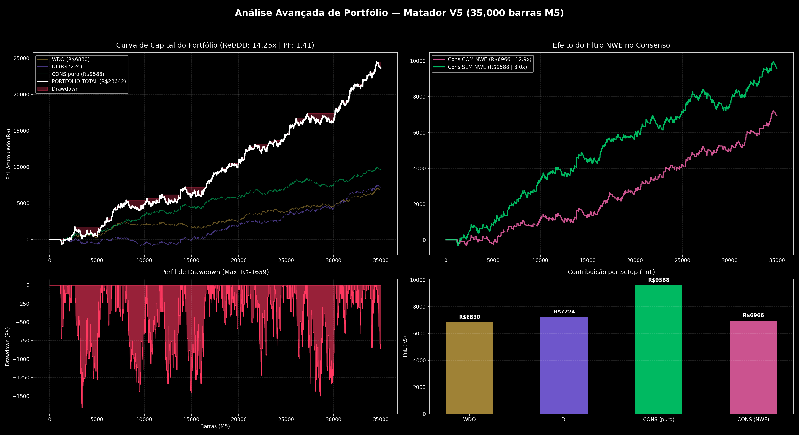

# Setup Matador V5 (Consenso WDO + DI + NWE)

Este documento registra a configuração oficial de produção do sistema de Pair Trading (WIN), juntamente com as estatísticas de validação cruzada do Backtest da versão V5.

---

## 1. Parâmetros de Produção (Core Matemático)

A arquitetura V5 substitui o antigo teste de cointegração de Johansen por um sistema de Filtros de Kalman duplos, combinados com um Envelope Nadaraya-Watson (NWE) para filtrar trades a favor da tendência. Ambos os ativos (Dólar e Juros) utilizam Filtro de Kalman.

### Lado A: Fluxo (WIN × WDO) — Filtro de Kalman + NWE
Responsável por reagir rápido aos movimentos de tape reading e fluxo de agressão.
*   **Modelo:** `KalmanBetaFilter`
*   `initial_beta`: `-22.5`
*   `trans_cov` (Variância de Transição): `1e-4` *(Modo Scalper/Rápido)*
*   `obs_cov` (Variância de Observação): `1e2`
*   `WINDOW` (Lookback Z-Score): `40` barras M5

### Lado B: Macro/Juros (WIN × DI) — Filtro de Kalman + NWE
Responsável por garantir que a estrutura de juros endossa o movimento do índice. Substitui o antigo Johansen por ser mais responsivo e robusto a distorções intraday.
*   **Modelo:** `KalmanBetaFilter`
*   `initial_beta`: `-10000.0`
*   `trans_cov` (Variância de Transição): `1e-3`
*   `obs_cov` (Variância de Observação): `1e1`
*   `WINDOW` (Lookback Z-Score): `60` barras M5

### Filtro de Envelope (Nadaraya-Watson)
Aplicado ao **preço do WIN** (não ao z-score) para evitar "facas caindo".
*   `Bandwidth`: `8`
*   `Lookback`: `95`
*   `MAE Multiplier`: `3.0`
*   `Proximity Multiplier`: `10%` da largura da banda.
*   `is_up`: Tendência crescente do NWE (nwe[t] >= nwe[t-1])

> **⚠️ Implementação Causal (Mai 2026):** O NWE **DEVE** usar apenas barras passadas (lookback-only). A implementação correta calcula o kernel Gaussian sobre `k = 0..min(t, lookback)` barras anteriores ao ponto `t`, com MAE rolling por barra. O uso de dados futuros (non-causal) invalida completamente o sinal `is_up` para trading em tempo real. Ref: `core/signals.py:calc_nwe_with_bands()` é o ground truth; `IndexChart.jsx:calcNWE()` é a réplica no frontend.

---

## 2. Regras de Trade (Z-Score e Limites Financeiros)

O robô exige o alinhamento de ambos os ativos para o Setup de Consenso.

*   **Z_ENTRY (Sinal de Entrada):** `1.4` *(O gatilho de disparo)*
*   **Z_ATTENTION (Atenção):** `1.2` *(O filtro de confirmação do segundo ativo)*
*   **Stop Loss (SL):** `300` pontos WIN
*   **Take Profit (TP):** `800` pontos WIN
*   **Breakeven:** `300` pontos (ativação), `0` pontos (lock)
*   **Horário de Entrada:** `09:00` a `15:00`
*   **Fechamento Forçado:** `17:40`

**Regra de Gatilho Exata (Consenso Puro):** O robô entra se o Z-Score de um ativo cruzar `1.4` e o do outro ativo confirmar a direção estando acima de `1.2`. O Setup de Consenso *não* utiliza o filtro NWE, focando puramente no alinhamento macro.

---

## 3. Estatísticas Comprovadas (Backtest V5 — 35.000 barras M5)

Resultados validados com amostra estendida (~1.2 anos) gerados pelo motor V5 (`run_matador_v5_johansen.py`).

### 3.1 Desempenho por Setup Individual

| Métrica | WDO (+NWE) | DI (+NWE) | Consenso COM NWE | **Consenso SEM NWE (puro)** |
| :--- | :--- | :--- | :--- | :--- |
| **PnL Total (R$)** | 6.830 | 7.224 | 6.966 | **9.588** |
| **Quantidade de Trades** | 411 | 576 | 402 | **598** |
| **Drawdown Máximo (R$)** | 859 | 1.207 | 540 | **1.192** |
| **Win Rate** | 37.7% | 35.6% | 38.1% | **38.1%** |
| **Profit Factor** | 1.45 | 1.33 | 1.47 | **1.44** |
| **Retorno / Drawdown** | 7.95x | 5.99x | 12.90x | **8.04x** |

### 3.2 Desempenho do Portfólio

| Portfólio | PnL (R$) | Max DD (R$) | Ret/DD | PF | Trades |
| :--- | :--- | :--- | :--- | :--- | :--- |
| PORT WDO+DI+CONS(puro) | **R$ 23.642** | R$ 1.659 | **14.25x** | 1.41 | 964 |

### 3.3 Johansen Gate (Decisão Definitiva)

O backtest V5 comprovou que o filtro de Cointegração de Johansen (janela=250, recheck=12 barras) **asfixia o sistema**:
*   Johansen esteve "aberto" apenas **16.8%** do tempo (WDO) e **17.0%** (DI).
*   O portfólio com Johansen rendeu apenas **R$ 237** (vs R$ 23.642 sem ele), com 30 trades no ano inteiro.
*   **Decisão:** O Johansen Gate **NÃO será utilizado** em produção.

### Conclusão do Setup
A evolução para a V5 ampliou a janela de validação de 15k para 35k barras M5, confirmando que o Filtro de Kalman puro com NWE é a abordagem mais lucrativa e robusta. O Setup de Consenso COM NWE apresenta o melhor Ret/DD (12.90x), enquanto o Consenso SEM NWE gera o maior lucro absoluto (R$ 9.588). O portfólio combinado (WDO+DI+CONS puro) entrega R$ 23.642 com Ret/DD de 14.25x.

---

## 4. Curvas de Capital Oficiais (V5)

O gráfico de performance avançado abaixo demonstra a Curva de Capital Agregada, o Drawdown Histórico Submerso (Underwater Chart) e a Contribuição por Setup.

(O relatório detalhado encontra-se em `REPORT_MATADOR_V5.md`. O relatório V4 anterior está preservado em `REPORT_MATADOR_V4.md`).

