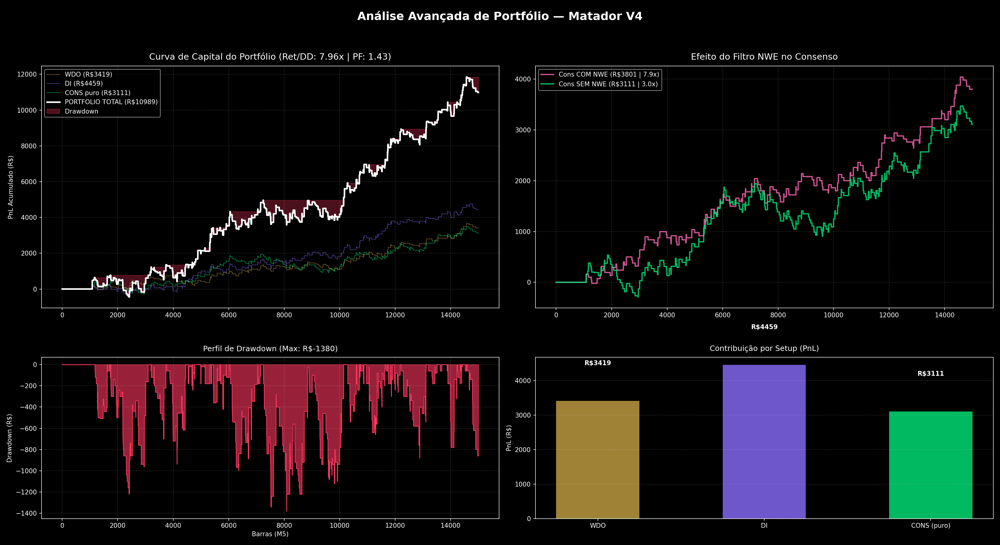

# 📊 Relatório de Backtest — Setup Matador V4

Este relatório contém os resultados validados do backtest atual.

## 1. Desempenho por Setup Individual

| Setup | PnL (R$) | Max DD (R$) | Ret/DD | Profit Factor | Trades | Win Rate |
|-------|----------|-------------|--------|---------------|--------|----------|
| WDO Kalman (+NWE) | R$3419 | R$560 | 6.11x | 1.54 | 170 | 37.6% |
| DI Kalman (+NWE) | R$4459 | R$579 | 7.70x | 1.49 | 241 | 37.3% |
| Consenso COM NWE | R$3801 | R$480 | 7.92x | 1.65 | 160 | 39.4% |
| Consenso SEM NWE (puro) | R$3111 | R$1032 | 3.01x | 1.31 | 262 | 34.0% |

## 2. Desempenho do Portfólio (Combinações)

| Portfólio | PnL (R$) | Max DD (R$) | Ret/DD | Profit Factor | Trades | Win Rate |
|-----------|----------|-------------|--------|---------------|--------|----------|
| PORT WDO+DI (sem cons) | R$7878 | R$900 | 8.75x | 1.51 | 300 | 36.7% |
| PORT WDO+DI+CONS(NWE) | R$11679 | R$1380 | 8.46x | 1.55 | 305 | 36.7% |
| PORT WDO+DI+CONS(puro) | R$10989 | R$1380 | 7.96x | 1.43 | 423 | 35.2% |

## 3. Curva de Capital (Equity Curve)

